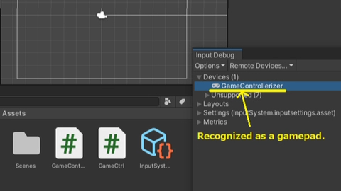
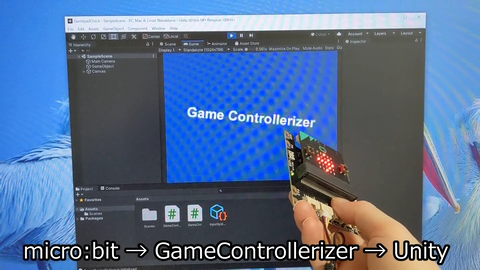

# Unity interface for GameControllerizer

This is interface description for Unity InputSystem. 

By default project, GameControllerizer is recognized as a Joystick.
Use this sample project, then it is recognized as a Gamepad.

It is useful for building your original game controller.

