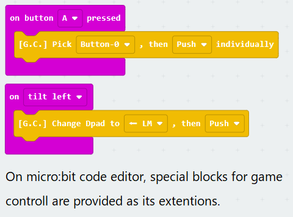

# Unity interface for GameControllerizer

Fastest way to build an original game controller for Unity !

This is the interface description for Unity InputSystem. With a [GameControllerizer](https://github.com/GameControllerizer/GettingStarted) and this code, you can connect microcontroller (ex. micro:bit, RasPi) or sensors to Unity without coding such as uart, http, bluetooth...

---

By the default, [GameControllerizer](https://github.com/GameControllerizer/GettingStarted) is recognized as a simple Joystick.
With this codes, it is recognized as a Gamepad (1-dpad, 2 -sticks and 12-buttons).

